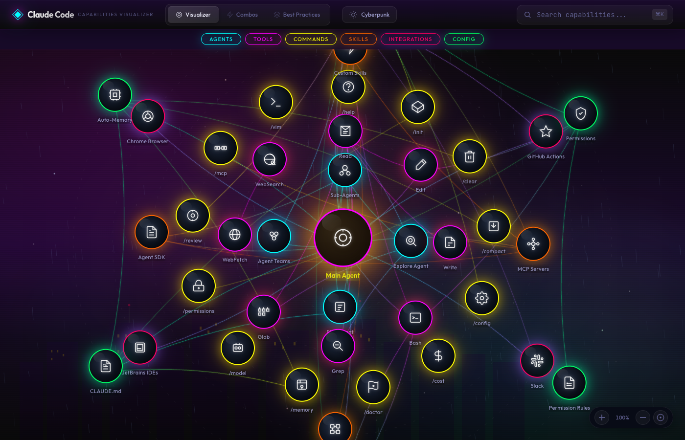

# Claude Code Capabilities Visualizer

An interactive, space-themed visualization tool for exploring Claude Code's capabilities, including agents, tools, commands, skills, and integrations.



## Features

- **Interactive Node Graph** - Explore capabilities as interconnected nodes with physics-based interactions
- **Multiple Themes** - Switch between Space, Ocean, Forest, Cyberpunk, and Dungeon themes
- **Search & Filter** - Quickly find capabilities by name or filter by category
- **Detailed Info Panel** - View descriptions, usage examples, and related capabilities
- **Capability Combos** - Discover powerful combinations of Claude Code features
- **Best Practices** - Learn recommended patterns for using Claude Code effectively

## Getting Started

### Prerequisites
- Node.js 18+
- npm

### Installation

```bash
cd nextjs-app
npm install
```

### Development

```bash
npm run dev
```

Open [http://localhost:3002](http://localhost:3002) in your browser.

### Production Build

```bash
npm run build
npm start
```

## Pages

| Page | Description |
|------|-------------|
| `/` | Main capability visualizer with interactive node graph |
| `/combos` | Curated combinations of capabilities for common workflows |
| `/best-practices` | Guidelines for effective Claude Code usage |

## Keyboard Shortcuts

| Key | Action |
|-----|--------|
| `Cmd/Ctrl + K` | Focus search |
| `+` | Zoom in |
| `-` | Zoom out |
| `0` | Reset zoom |
| `Esc` | Close panel / Clear search |

## Tech Stack

- [Next.js 16](https://nextjs.org/) - React framework
- [React 19](https://react.dev/) - UI library
- HTML5 Canvas - Connection rendering
- Vanilla CSS - Styling with custom properties

## Contributing

1. Fork the repository
2. Create a feature branch
3. Make your changes
4. Submit a pull request

## License

MIT
